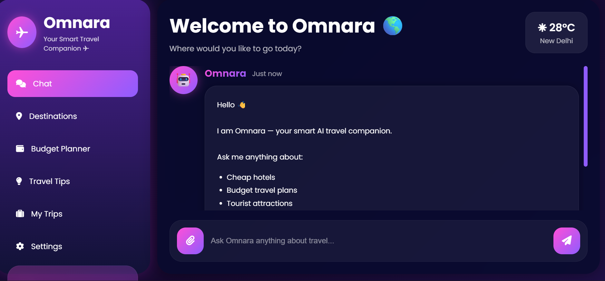
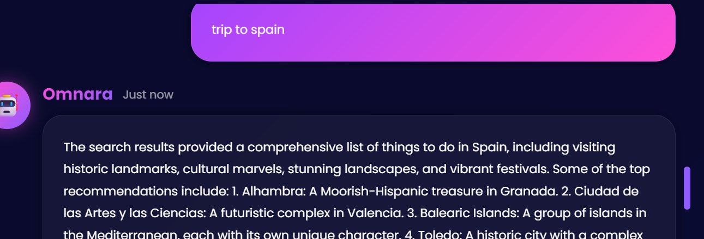

# 🌍 Omnara — AI Travel Assistant

Omnara is an AI-powered travel planning assistant built using Flask, LangGraph, LangChain, and Ollama.

It helps users:
- plan trips
- estimate budgets
- discover tourist attractions
- customize travel plans
- search travel information intelligently

---

# ✨ Features

- 🤖 AI Travel Chatbot
- 🌴 Destination Recommendations
- 💰 Budget Planner
- 🏨 Hotel Suggestions
- 🌦 Weather Information
- 🔎 Web Search Integration
- 🎨 Modern Responsive UI
- 🧠 LangGraph Agent Workflow
- ⚡ Groq Ultra-fast Inference

---

# 🛠 Tech Stack

- Python
- Flask
- LangChain
- LangGraph
- Groq API
- Llama-3.3-70B-Versatile
- HTML/CSS/JavaScript
- DuckDuckGo Search

---

# 📸 Screenshots

## Home UI



## Chat Interface




---

# 🚀 Run Locally

```bash
git clone https://github.com/YOUR_USERNAME/omnara-ai-travel-assistant.git

cd omnara-ai-travel-assistant

uv sync

uv run python app.py